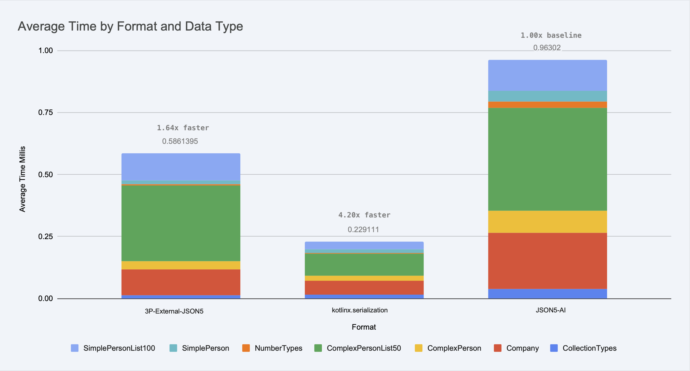

# json5-kotlin
JSON5 implementation for Kotlin/JVM


A robust JSON5 parser and serializer for Kotlin that extends JSON with helpful features like comments, trailing commas, and unquoted keys while maintaining full backward compatibility with JSON.

> [!CAUTION]
> _This is an experimental proof-of-concept project developed entirely using agentic AIs. Some functionality may be incomplete or unstable ([learn more](https://hossainkhan.medium.com/vibe-coding-to-blind-coding-986f8f0b7b09))_

<a href="https://github.com/hossain-khan/json5-kotlin/tree/main/benchmark"></a>

## Features

[JSON5](https://json5.org/) extends JSON with the following features:

- **Comments**: `// line comments` and `/* block comments */`
- **Trailing commas**: In objects and arrays
- **Unquoted keys**: Object keys can be unquoted if they're valid identifiers
- **Single quotes**: Strings can use single quotes
- **Multi-line strings**: Strings can span multiple lines with `\` at line end
- **Numbers**: Hexadecimal numbers, leading/trailing decimal points, explicit positive signs, infinity, and NaN
- **Backward compatible**: All valid JSON is valid JSON5

## Installation

Add the dependency to your `build.gradle.kts`:

```kotlin
repositories {
    maven {
        name = "GitHubPackages"
        url = uri("https://maven.pkg.github.com/hossain-khan/json5-kotlin")
        credentials {
            username = project.findProperty("gpr.user") as String? ?: System.getenv("USERNAME")
            password = project.findProperty("gpr.key") as String? ?: System.getenv("TOKEN")
        }
    }
}

dependencies {
    implementation("hossain.dev:json5kt:1.1.0")
}
```

### Authentication for GitHub Packages

To access GitHub Packages, you need to authenticate with GitHub. You can do this by:

1. **Using environment variables:**
   ```bash
   export USERNAME=your_github_username
   export TOKEN=your_github_personal_access_token
   ```

2. **Using gradle.properties:**
   ```properties
   gpr.user=your_github_username
   gpr.key=your_github_personal_access_token
   ```

You can generate a personal access token at [GitHub > Settings > Developer settings > Personal access tokens](https://github.com/settings/tokens) with `read:packages` permission.

## Usage

### Basic Parsing and Stringifying

```kotlin
import dev.hossain.json5kt.JSON5

// Parse JSON5 to strongly-typed JSON5Value objects
val json5 = """
{
    // Configuration for my app
    name: 'MyApp',
    version: 2,
    features: ['auth', 'analytics',], // trailing comma
}
"""

val parsed = JSON5.parse(json5)
// Returns: JSON5Value.Object

// Access values in a type-safe way
when (parsed) {
    is JSON5Value.Object -> {
        val name = parsed.value["name"] as? JSON5Value.String
        val version = parsed.value["version"] as? JSON5Value.Number.Integer
        val features = parsed.value["features"] as? JSON5Value.Array
        
        println("App name: ${name?.value}") // "MyApp"
        println("Version: ${version?.value}") // 2
        println("Features: ${features?.value?.map { (it as JSON5Value.String).value }}") // ["auth", "analytics"]
    }
}

// Stringify Kotlin objects to JSON5
val data = mapOf(
    "name" to "MyApp", 
    "version" to 2,
    "enabled" to true
)
val json5String = JSON5.stringify(data)
// Returns: {name:'MyApp',version:2,enabled:true}
```

### Migration from parseToAny (Deprecated)

If you were previously using the deprecated `parseToAny` method, here's how to migrate:

```kotlin
val result = JSON5.parse("""{"key": "value"}""")
when (result) {
    is JSON5Value.Object -> {
        val key = result.value["key"] as? JSON5Value.String
        println(key?.value) // "value"
    }
}

// Alternative: Convert to raw objects when needed
fun JSON5Value.toRawObject(): Any? {
    return when (this) {
        is JSON5Value.Null -> null
        is JSON5Value.Boolean -> this.value
        is JSON5Value.String -> this.value
        is JSON5Value.Number.Integer -> this.value.toDouble()
        is JSON5Value.Number.Decimal -> this.value
        is JSON5Value.Number.Hexadecimal -> this.value.toDouble()
        is JSON5Value.Number.PositiveInfinity -> Double.POSITIVE_INFINITY
        is JSON5Value.Number.NegativeInfinity -> Double.NEGATIVE_INFINITY
        is JSON5Value.Number.NaN -> Double.NaN
        is JSON5Value.Object -> this.value.mapValues { it.value.toRawObject() }
        is JSON5Value.Array -> this.value.map { it.toRawObject() }
    }
}

// Using the helper for compatibility
val rawResult = JSON5.parse("""{"key": "value"}""").toRawObject()
val map = rawResult as Map<String, Any?>
println(map["key"]) // "value"
```

### Integration with kotlinx.serialization

```kotlin
import dev.hossain.json5kt.JSON5
import kotlinx.serialization.Serializable

@Serializable
data class Config(
    val appName: String,
    val version: Int,
    val features: List<String>,
    val settings: Map<String, String>
)

// Serialize to JSON5
val config = Config(
    appName = "MyApp",
    version = 2,
    features = listOf("auth", "analytics"),
    settings = mapOf("theme" to "dark", "lang" to "en")
)

val json5 = JSON5.encodeToString(Config.serializer(), config)
// Result: {appName:'MyApp',version:2,features:['auth','analytics'],settings:{theme:'dark',lang:'en'}}

// Deserialize from JSON5 (with comments and formatting)
val json5WithComments = """
{
    // Application configuration
    appName: 'MyApp',
    version: 2, // current version
    features: [
        'auth',
        'analytics', // trailing comma OK
    ],
    settings: {
        theme: 'dark',
        lang: 'en',
    }
}
"""

val decoded = JSON5.decodeFromString(Config.serializer(), json5WithComments)
// Returns: Config instance
```

### Advanced Features

```kotlin
// JSON5 supports various number formats
val numbers = JSON5.parse("""
{
    hex: 0xDECAF,
    leadingDot: .8675309,
    trailingDot: 8675309.,
    positiveSign: +1,
    scientific: 6.02e23,
    infinity: Infinity,
    negativeInfinity: -Infinity,
    notANumber: NaN
}
""")

// Access different number types
when (numbers) {
    is JSON5Value.Object -> {
        val hex = numbers.value["hex"] as? JSON5Value.Number.Hexadecimal
        val infinity = numbers.value["infinity"] as? JSON5Value.Number.PositiveInfinity
        val nan = numbers.value["notANumber"] as? JSON5Value.Number.NaN
        
        println("Hex value: ${hex?.value}") // 912559
        println("Is infinity: ${infinity != null}") // true
        println("Is NaN: ${nan != null}") // true
    }
}

// Multi-line strings and comments
val complex = JSON5.parse("""
{
    multiLine: "This is a \
multi-line string",
    /* Block comment
       spanning multiple lines */
    singleQuoted: 'Can contain "double quotes"',
    unquoted: 'keys work too'
}
""")

// Working with the parsed result
when (complex) {
    is JSON5Value.Object -> {
        val multiLine = complex.value["multiLine"] as? JSON5Value.String
        val singleQuoted = complex.value["singleQuoted"] as? JSON5Value.String
        
        println("Multi-line: ${multiLine?.value}")
        println("Single quoted: ${singleQuoted?.value}")
    }
}
```

## Building the Project

This project uses [Gradle](https://gradle.org/) with Java 21:

```bash
./gradlew build    # Build the library
./gradlew test     # Run tests
./gradlew check    # Run all checks including tests
./gradlew :benchmark:run # Runs the benchmark
```

## License

This project is licensed under the terms specified in the [LICENSE](LICENSE) file.
